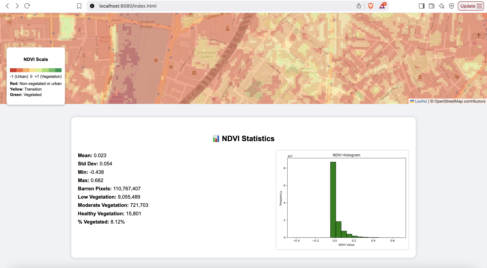

# 🌱 GeoTrack: A Scalable Pipeline for Satellite Image Ingestion and NDVI Analysis

GeoTrack is a lightweight satellite image analysis tool designed to extract and visualise NDVI (Normalized Difference Vegetation Index) from multi-band satellite data. Built using Python, FastAPI, Leaflet.js, and rasterio, this application is structured for fast deployment and ease of use, especially in public health, environmental monitoring, and urban planning contexts.

## 🛰️ Sample NDVI Output





## 🔍 Motivation

This project aligns with the goals of the IMAGO initiative, which seeks to unlock the social science and public health potential of satellite imagery. GeoTrack demonstrates:
- Automated NDVI computation from satellite bands
- Web-based NDVI visualisation with histogram and vegetation classification
- FastAPI-based backend, with modular endpoints
- Ready for Azure deployment and containerisation

## ⚙️ Features

- 📤 Upload multi-band satellite images (e.g., Landsat, Sentinel)
- 🌿 Compute NDVI using NIR and Red bands
- 🗺️ Visualise NDVI as Leaflet map layers
- 📊 View statistics: mean, std dev, vegetation class counts, histogram
- 📁 Download processed NDVI GeoTIFF
- 🧩 Modular FastAPI backend, ideal for scale-up or extension

##🔭 Future Scope: Land Surface Temperature (LST)

-While NDVI captures vegetation health, Land Surface Temperature (LST) is crucial for environmental monitoring, urban heat analysis, and public health planning.
-In future versions, GeoTrack will support:
-🌡️ LST computation from Landsat Band 10 (thermal infrared)
-📊 Integration of LST with NDVI for multi-dimensional analytics
-🗺️ Layer toggle to compare vegetation and surface heat
-📦 Additional routes (/lst) in the FastAPI backend
-📌 Visualization using leaflet.js heat layers or color ramp overlays


## 🚀 Technologies Used

- **Backend**: Python, FastAPI, rasterio, NumPy, Matplotlib
- **Frontend**: Leaflet.js, vanilla JS, HTML/CSS
- **Packaging**: Docker-ready
- **Deployment**: Designed for Azure App Services or Azure Container Apps

## 🛰 Example Workflow

1. Upload NIR and Red bands (e.g., `B08.jp2`, `B04.jp2`)
2. Backend computes NDVI and returns `.tif`
3. NDVI visualisation renders on interactive Leaflet map
4. Histogram and vegetation breakdown shown below the map

## 💡 Why This Project?

GeoTrack showcases:
- End-to-end pipeline development in geospatial data science
- REST API principles for geospatial workflows
- Full DevOps lifecycle compatibility (code, test, deploy, monitor)
- Suitable foundation for extending to LST, urban heat, or flood risk models
:

#🚀 Deployment Guide
GeoTrack is fully containerized and ready for both local development and Azure deployment.

#🧪 Local Development Setup
## Clone the repository
git clone https://github.com/nagasriramnani/GeoTrack-Visualizer.git
cd GeoTrack-Visualizer
## Create and activate virtual environment
python3 -m venv geoenv
source geoenv/bin/activate
## Install dependencies
pip install -r requirements.txt
## Start the backend server
uvicorn backend.app.main:app --reload
Then open frontend/index.html in your browser (e.g., http://localhost:8080/index.html).

##Azure DEPLOYMENT
For Azure deployment we can use the Azure App services and we can deploy it from azure app services.


## 👤  Naga Sri Ram Kochetti. Msc in Big Data & High Performance Computing (UOL)
📍 London, UK

## 🧪 Try Locally

```bash
# Backend
uvicorn backend.main:app --reload

# Frontend (from frontend/ folder)
python3 -m http.server 8080

